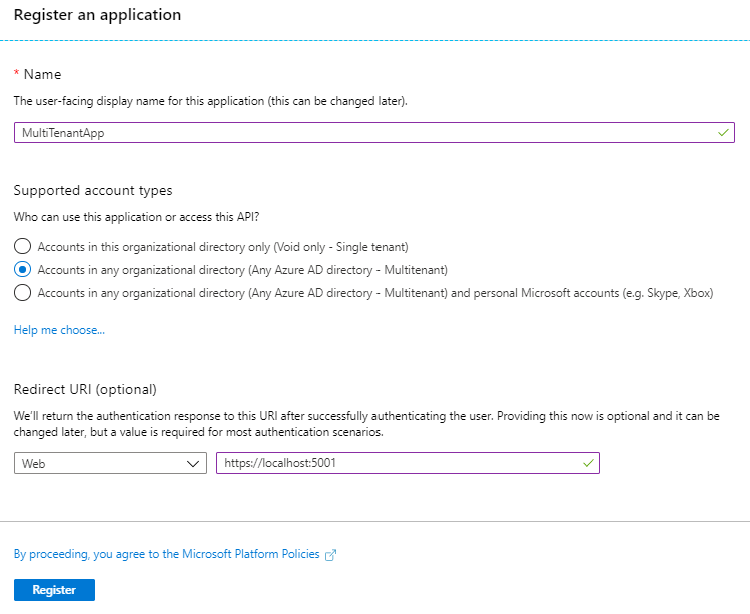
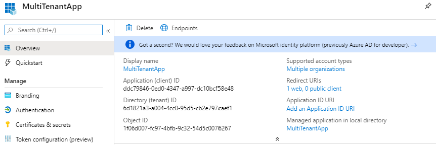
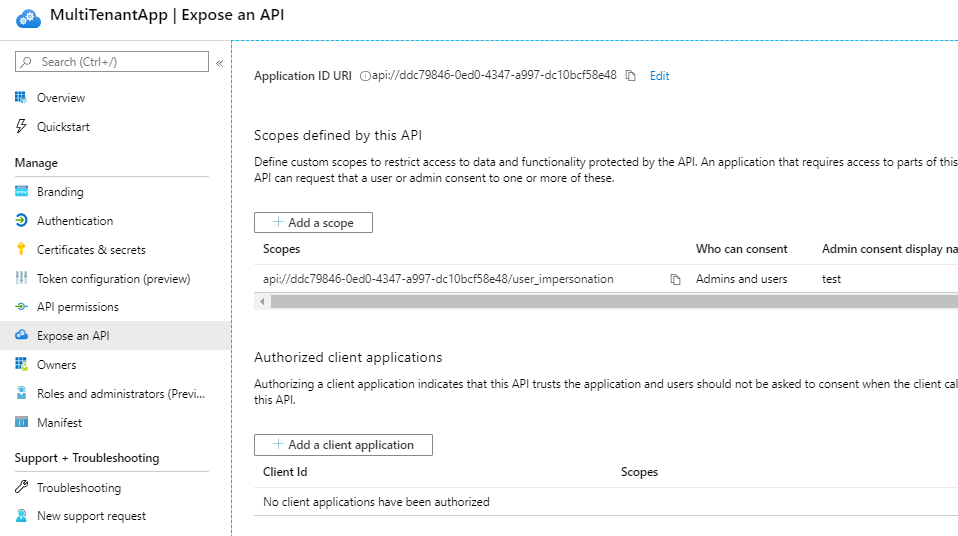
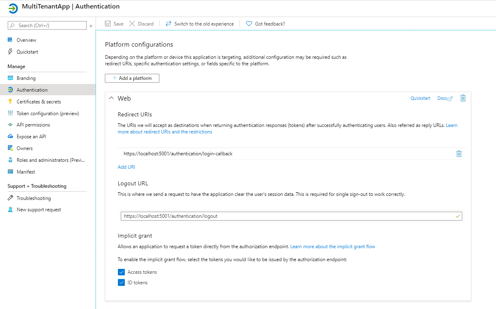
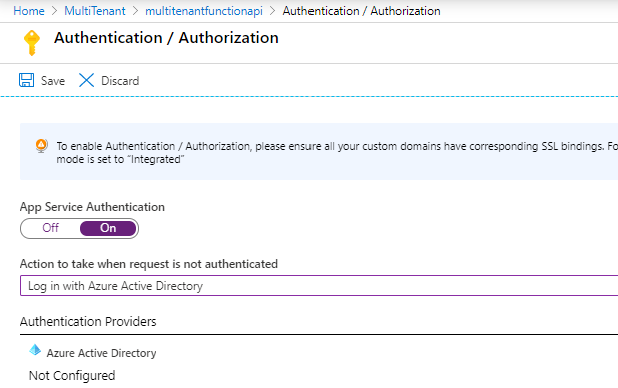
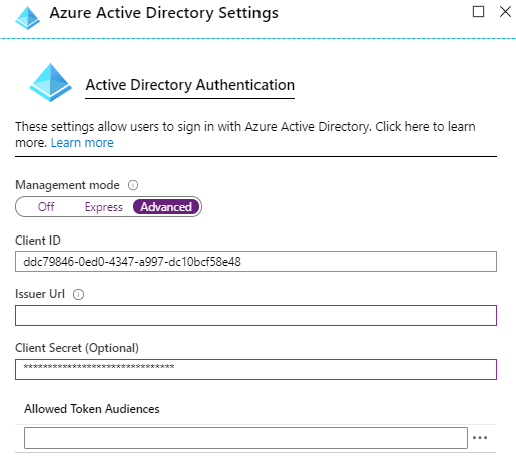
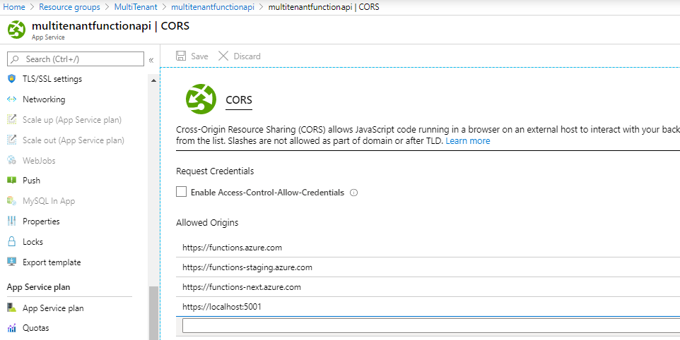

## Summary
This solution will allow you to authenticate and make calls to an Azure function with Blazor WebAssembly.The Azure function will be Azure Active Directory protected.

## Prerequisites

- Use the latest Blazor preview installed 3.2.0-preview3.20168.3. See [here](https://devblogs.microsoft.com/aspnet/blazor-webassembly-3-2-0-preview-3-release-now-available/) for more info.

## Getting Started

First, we need to create an app registration in your Azure Active Directory. You can do this by going to https://portal.azure.com for the Tenant you want to deploy your app in. Create an application like below. Set the redirect URL to localhost so that you can use it on your local machine.



After your registration is completed it should look like this:



Go to the "Expose Api" page and set the Application ID URI to API://clientid. My client id in this case is ddc79846-0ed0-4347-a997-dc10bcf58e48. After this, you also need to set the scope. Set this to API://clientid/user_impersonation and Save.



Now, let's go to the Authentication page and change the URLs to match the ones below. Als make sure to check the **Access Tokens** and **ID tokens** checkbox. If you haven't already done so make the app multi-tenant at the bottom.



## Azure function config
I am not going in-depth on how to deploy an Azure function and will go straight to the configuration. Before we do that we need to take 2 things from the application registration we just configured

- Client ID
- Client Secret (Generate one in the Certificates & Secrets page)

After you have copied these go to your azure function and go to the new still in preview portal of Azure functions. Go to the Authentication/Authorization page.

Do 3 things here:
- Switch App Service Authentication to **On**
- Set Action to take when a request is not authenticated to **Log in with Azure Active Directory**
- Click the Azure Active Directory row



The second to last step is to set the Active Directory Authentication to advanced and paste you two values we copied earlier.



This should be enough to get it working. Still, if you want to make sure it works on your local machine we have one more setting to go. 

Go to the cors page of azure functions and set an extra cors rule to your localhost environment as I did:



## Configure the Solution
For you to be able to run this solution there are a few settings that need to be done. Open the solution (or folder if you are in vs code) and edit the appsettings.json file in the **Web** project. Set your own clientId and API backend. This can be the Azure function we just configured or a localhost function. Do note that on your local machine you can not test the AD authentication.

```json
{
  "clientId": "ddc79846-0ed0-4347-a997-dc10bcf58e48",
  "postLogoutUrl": "https://localhost:5001",
  "apiBackend": "https://<your azure functionn>.azurewebsites.net/api/" // or "https://localhost:7071/api"
}
```

That is it. If something is not working for you, feel free to create an issue.
